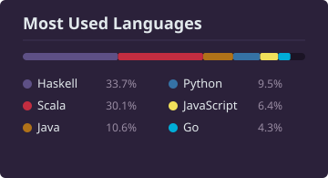

# Hi there, I'm Alex Cano 👋

 

**Software Engineer & Polyglot Developer**  
*Passionate about backend architectures, functional programming, scalable data pipelines, and developer tooling.*

---

### 🛠️ Languages & Technologies

- **Languages:**  
  
  
  
  
  
  
  

- **Data, Cloud & Ecosystem:**  
  
  
  
  
  
  

---

### 📊 GitHub Analytics

  
  

  

---

### 🐍 Contribution Activity

<picture>
  <source media="(prefers-color-scheme: dark)" srcset="./profile/github-snake-dark.svg" />
  
</picture>

---

  ✨ Automated with GitHub Actions • Preserving the Synthwave aesthetic

